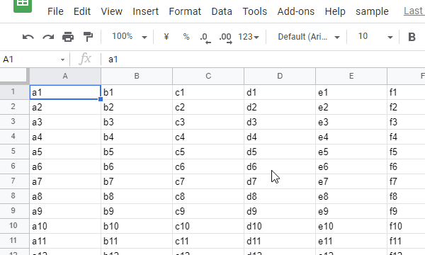

# Creating PNG Image with Alpha Channel using Google Apps Script

This is a sample script for creating a PNG image with [the alpha channel](https://en.wikipedia.org/wiki/Alpha_compositing) using Google Apps Script.

The PNG image with the alpha channel is the image includes the transparent background. I have been looking for the method for creating such image using Google Apps Script. It is considered that when this will be achieved, it will be able to be used for various situations. For example, it is considered the following situations.

- Because the base data is the vector drawing, the images like the drawing can be created using Google Apps Script.
- The custom image buttons can be created to Google Spreadsheet using Google Apps Script.
- The custom image can be created to Google Document using Google Apps Script.

Finally, I could find it. So I would like to introduce it. When this was useful for your situation, I'm glad.

## Flow

The flow for this method is as follows.

1. Create Google Slides with the given page size.

   - For this, Google Apps Script library of [DocsServiceApp](https://github.com/tanaikech/DocsServiceApp) is used.

2. Set alpha channel to the background of the page in Google Slides.

   - This is the important for this method. By setting this, the image with the alpha channel can be created.

3. Create the shapes using the shapes and texts.

   - This is the image.

4. Export the slide as the PNG with the alpha channel using the method of Export in Drive API as a blob.

   - In the current stage, at the values of `exportFormats` in the method of "About: get" in Drive API, Google Slides can be exported as `application/vnd.oasis.opendocument.presentation`, `application/pdf`, `application/vnd.openxmlformats-officedocument.presentationml.presentation` and `text/plain`. Unfortunately, the mimeType of `image/png` is not included.
   - But when I tested this, I could confirm that Google Slides can be exported as the PNG data with the alpha channel. This was the key point for achieving this goal.
   - When this method is used, Google slides can be also exported as the SVG data.
   - As an additional information, when Google Slides is exported as the thumbnail, the PNG data has no alpha channel. Please be careful this.

## Usage

In this sample script, a Google Apps Script library of [DocsServiceApp](https://github.com/tanaikech/DocsServiceApp) is used.

### 1. Install Google Apps Script library of [DocsServiceApp](https://github.com/tanaikech/DocsServiceApp#how-to-install).

The library's project key is `108j6x_ZX544wEhGkgddFYM6Ie09edDqXaFwnW3RVFQCLHw_mEueqUHTW`. [Ref](https://github.com/tanaikech/DocsServiceApp#how-to-install) You can see the method for installing the GAS library at the official document. [Ref](https://developers.google.com/apps-script/guide_libraries)

### 2. Enable Drive API.

Please enable Drive API at Advanced Google services. [Ref](https://developers.google.com/apps-script/guides/services/advanced#enabling_advanced_services)

### 3. Sample script.

This sample script puts the created image to Spreadsheet as a sample. So before you run the script, please set the variable of `spreadsheetId`.

```javascript
function myFunction() {
  // 1. Create new Google Slides with the custom page size. This is used as a temporal file.
  const width = 200;
  const height = 200;
  const object = {
    title: "temp",
    width: { unit: "pixel", size: width },
    height: { unit: "pixel", size: height },
  };
  const presentationId = DocsServiceApp.createNewSlidesWithPageSize(object);

  // 2. Create a sample shape to Google Slides.
  const s = SlidesApp.openById(presentationId);
  const slide = s.getSlides()[0];
  slide.getBackground().setTransparent();
  const obj = slide
    .insertShape(SlidesApp.ShapeType.HEART)
    .setWidth(130)
    .setHeight(130)
    .alignOnPage(SlidesApp.AlignmentPosition.CENTER);
  obj.getFill().setTransparent();
  obj.getBorder().setWeight(10).getLineFill().setSolidFill("#ff0000");
  s.saveAndClose();

  // 3. Export Google Slides as a PNG data with the alpha channel.
  const url = `https://docs.google.com/feeds/download/presentations/Export?id=${presentationId}&exportFormat=png`;
  const blob = UrlFetchApp.fetch(url, {
    headers: { authorization: "Bearer " + ScriptApp.getOAuthToken() },
  }).getBlob();

  // 4. Put the created image to Google Spreadsheet.
  const spreadsheetId = "###"; // Please set the Spreadsheet ID.
  const sheetName = "Sheet1";
  const sheet = SpreadsheetApp.openById(spreadsheetId).getSheetByName(
    sheetName
  );
  sheet.insertImage(blob, 2, 2);

  // 5. Remove the Google Slides.
  DriveApp.getFileById(presentationId).setTrashed(true);
}
```

- Of course, for example, when a Google Slides is manually created and you manually create the shape, you can also use the following script.

  ```javascript
  function myFunction2() {
    const presentationId = "###"; // Please set the Google Slides ID.
    const spreadsheetId = "###"; // Please set the Spreadsheet ID.
    const sheetName = "Sheet1";

    const s = SlidesApp.openById(presentationId);
    const slide = s.getSlides()[0];
    slide.getBackground().setTransparent();
    s.saveAndClose();
    const url = `https://docs.google.com/feeds/download/presentations/Export?id=${presentationId}&exportFormat=png`;
    const blob = UrlFetchApp.fetch(url, {
      headers: { authorization: "Bearer " + ScriptApp.getOAuthToken() },
    }).getBlob();

    const sheet = SpreadsheetApp.openById(spreadsheetId).getSheetByName(
      sheetName
    );
    sheet.insertImage(blob, 2, 2);
  }
  ```

### 4. Testing.

When above script is run, the following result is obtained. From this result situation, you can see that the created image has the alpha channel.



## Summary

As the result, using this method, the shapes written in Google Slides can be exported as the PNG image with the alpha channel.

## Reference

- [DocsServiceApp](https://github.com/tanaikech/DocsServiceApp)
